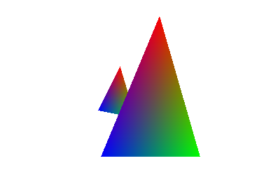

# A software renderer

This is a software renderer/rasterizer written in [D](https://dlang.org/). 
It is a learning project, hence do not assume this great D code.

By default, it will render 2 triangles. You can look around using a mouse.

I do not plan to work on this anymore. Maybe one I'll add texturing.

# Dependencies
SDL2. The program will fail if it cannot find it.
